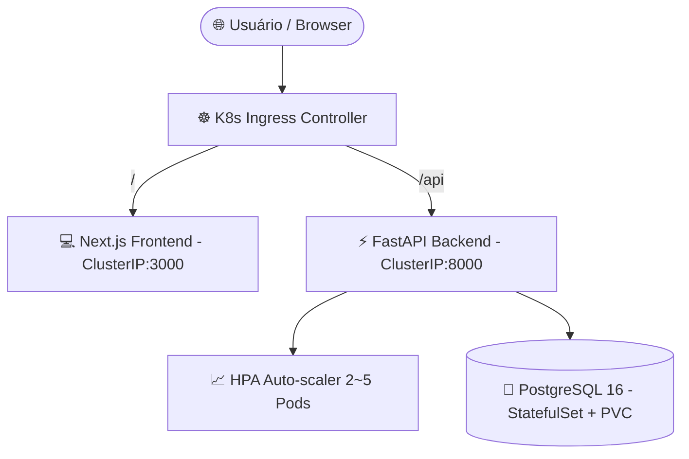

# 💳 Carteira Digital - Enterprise Financial & FIIs Dashboard

[](https://fastapi.tiangolo.com/)
[](https://nextjs.org/)
[](https://www.typescriptlang.org/)
[](https://kubernetes.io/)
[](https://www.postgresql.org/)
[](https://www.docker.com/)
[](https://jwt.io/)
[](LICENSE)

> Sistema Full-Stack Enterprise multi-inquilino (*multi-tenant*) desenvolvido em **Next.js 14**, **FastAPI (Python)**, **PostgreSQL** e orquestrado via **Kubernetes (K8s)** para gestão de finanças pessoais, cartões de crédito e análise automatizada de **Fundos de Investimento Imobiliário (FIIs)** em tempo real da B3.

---

## 📌 Arquitetura & Orquestração K8s

O projeto é estruturado em microsserviços containerizados com resiliência de dados e suporte a auto-escalonamento via Kubernetes:



---

## 🚀 Novas Atualizações e Recursos de Regra de Negócio

### 🆕 Isolamento Estrito de Novas Contas & Modelos Padrão
- **Contas Novas Isolas**: Corrigida a lógica de registro de usuários. Agora, quando um novo usuário realiza cadastro (ex: teste para um novo membro familiar), ele inicia com ambiente individual e **2 cartões de modelo limpos** ("*Cartão Principal Modelo*" e "*Cartão Secundário Modelo*"), com limites zerados para que possa preencher com suas informações próprias.
- **Prevenção de Vazamento de Dados**: Os dados e lançamentos de outros usuários cadastrados anteriormente são mantidos sob **isolamento estrito multi-tenant (Multi-User ID)** via tokens JWT.

---

## 🛠️ Tecnologias e Dependências

| Categoria | Tecnologias Utilizadas |
|---|---|
| **Frontend** | Next.js 14, React 18, TypeScript, TailwindCSS, Recharts, Lucide Icons |
| **Backend API** | Python 3.12, FastAPI, Uvicorn, SQLAlchemy ORM, Pydantic v2 |
| **Banco de Dados & Dados** | PostgreSQL 16 com volume persistente (StatefulSet no K8s) |
| **Segurança & Auth** | Passlib (PBKDF2 HMAC SHA-256), JWT Tokens, CORS Middleware |
| **Orquestração** | Kubernetes Manifests (StatefulSet, Deployment, HPA, Ingress, Secrets) |

---

## 🏗️ Como Executar a Aplicação

### 1. Via Docker Compose (Ambiente de Desenvolvimento)

```bash
# Iniciar o banco PostgreSQL, Backend e Frontend unificados
docker-compose up -d --build

# Acessar a aplicação:
# Frontend: http://localhost:3005
# Backend API: http://localhost:8010
```

### 2. Via Kubernetes (Cluster Local ou Nuvem)

```bash
# Aplicar todos os recursos K8s em ordem
kubectl apply -f k8s/
```

---

## 📄 Licença

Projeto desenvolvido sob a licença [MIT](LICENSE).
